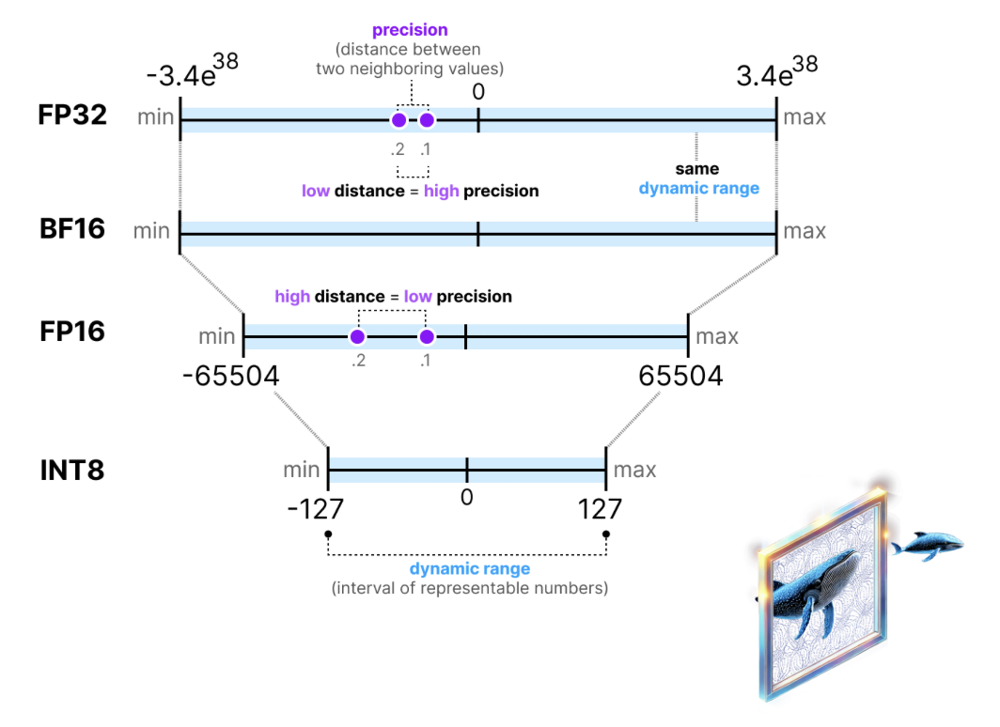

<div translate-x--12>

<h1>I’ve Got 99 Problems, but LLMs Ain’t One!</h1>

Cedric Clyburn · Senior Developer Advocate, Red Hat

</div>

<div w-full absolute bottom-0 left-0 flex items-center transform="translate-y--6">
  <div w-full flex items-center justify-between gap-4 px-5>
    <div text-sm opacity-70>
      Ai4 Las Vegas · 2025
  </div>
    <div flex items-center gap-4>
      
      
    </div>
  </div>
</div>

---
layout: default
class: px-16
glowSeed: 205
---

<div class="grid grid-cols-3 gap-8 items-start">
  <div class="col-span-2">
    <div text-4xl font-bold>Why private and local AI?</div>
    <div mt-4 text-xl opacity-80>
      83% of organizations are moving workloads back to private cloud or on‑prem for privacy and cost
      <span text-sm opacity-70>(<a href="https://8198920.fs1.hubspotusercontent-na1.net/hubfs/8198920/Barclays_Cio_Survey_2024-1.pdf" target="_blank" class="underline decoration-dotted">Barclays CIO Survey 2024</a>)</span>.
    </div>
    <div v-click class="mt-6 grid grid-cols-2 gap-3 text-sm">
      <div bg="white/5" border="1 solid white/10" rounded-lg p-3>
        <div font-bold>Control & Privacy</div>
        Keep data on your infra, control updates and versions
      </div>
      <div bg="white/5" border="1 solid white/10" rounded-lg p-3>
        <div font-bold>Cost Predictability</div>
        Avoid unpredictable egress/inference bills
      </div>
      <div bg="white/5" border="1 solid white/10" rounded-lg p-3>
        <div font-bold>Customization</div>
        Tune models, add guardrails, ship your cadence
      </div>
      <div bg="white/5" border="1 solid white/10" rounded-lg p-3>
        <div font-bold>Portability</div>
        Run on Linux, Kubernetes, or bare metal
      </div>
    </div>
  </div>
  <div v-click>
    <div text-2xl font-semibold mb-3>About me</div>
    <div class="flex items-start justify-between gap-4">
      <div class="text-sm leading-6">
        <div> Cedric Clyburn </div>
        <div class="font-bold"> Senior Developer Advocate, Red Hat </div>
        <div mt-2>
          Organizer, <a href="https://kcdnewyork.com" target="_blank" class="underline decoration-dotted">KCD New York</a>
        </div>
        <div> Open source + community builder · @cedricclyburn </div>
        <div mt-2>
          <span class="font-bold">Technical Educator</span>
        </div>
        <ul class="mt-1 leading-6">
          <li>
            <a href="https://www.youtube.com/watch?v=00Q0G84kq3M&" target="_blank" class="underline decoration-dotted">RAG vs Fine‑Tuning</a>
          </li>
          <li>
            <a href="https://www.youtube.com/watch?v=5RIOQuHOihY" target="_blank" class="underline decoration-dotted">Ollama</a>
          </li>
          <li>
            <a href="https://www.youtube.com/watch?v=McLdlg5Gc9s" target="_blank" class="underline decoration-dotted">vLLM</a>
          </li>
        </ul>
      </div>
      
    </div>
  </div>
</div>

<div v-click class="mt-8 w-full text-center">
  <div class="inline-block tracking-wide text-white">Let's get started!</div>
  <div class="underline-animate mx-auto mt-2"></div>
</div>

---
class: py-10
---

# Agenda

<div grid grid-cols-2 gap-4 mt-4>
  <div v-click bg="white/5" border="1 solid white/10" rounded-lg p-4>
    <div i-carbon:explode text-yellow-300 mr-2 inline-block /> Open models: what’s new in OSS
  </div>
  <div v-click bg="white/5" border="1 solid white/10" rounded-lg p-4>
    <div i-carbon:face-dissatisfied mr-2 inline-block /> Why hosted APIs aren’t always enough
  </div>
  <div v-click bg="white/5" border="1 solid white/10" rounded-lg p-4>
    <div i-carbon:edge-cluster mr-2 inline-block /> Private & sovereign AI options
  </div>
  <div v-click bg="white/5" border="1 solid white/10" rounded-lg p-4>
    <div i-carbon:list mr-2 inline-block /> How to deploy: local → production
  </div>
  <div v-click bg="white/5" border="1 solid white/10" rounded-lg p-4>
    <div i-carbon:flow-modeler mr-2 inline-block /> Tooling: llama.cpp, vLLM, TGI
  </div>
  <div v-click bg="white/5" border="1 solid white/10" rounded-lg p-4>
    <div i-carbon:money mr-2 inline-block /> Cut GPU cost by ~50%: quantization
  </div>
</div>

---
class: py-10
glowSeed: 130
---

# Open Source Model Explosion

<div mt-2 grid grid-cols-3 gap-4>
  <div bg="white/5" rounded-lg p-4>
    <div font-bold mb-2>Foundation models</div>
    <div text-sm opacity-90> Llama 3.x, Qwen, DeepSeek, Mistral, Gemma </div>
    <div mt-3 flex flex-wrap gap-2 text-xs>
      <div px-2 py-1 rounded bg="white/8">instruct</div>
      <div px-2 py-1 rounded bg="white/8">base</div>
      <div px-2 py-1 rounded bg="white/8">MoE</div>
    </div>
  </div>
  <div bg="white/5" rounded-lg p-4>
    <div font-bold mb-2>Modalities</div>
    <div text-sm opacity-90> Text, vision, audio, diffusion, multi‑modal </div>
    <div mt-3 flex flex-wrap gap-2 text-xs>
      <div px-2 py-1 rounded bg="white/8">VLM (Llava, Idefics)</div>
      <div px-2 py-1 rounded bg="white/8">ASR/TTS</div>
      <div px-2 py-1 rounded bg="white/8">Diffusion</div>
    </div>
  </div>
  <div bg="white/5" rounded-lg p-4>
    <div font-bold mb-2>Ecosystem</div>
    <div text-sm opacity-90> Tokenizers, safetensors, GGUF, serving runtimes </div>
    <div mt-3 flex flex-wrap gap-2 text-xs>
      <div px-2 py-1 rounded bg="white/8">llama.cpp</div>
      <div px-2 py-1 rounded bg="white/8">vLLM</div>
      <div px-2 py-1 rounded bg="white/8">TGI</div>
      <div px-2 py-1 rounded bg="white/8">GGUF</div>
      <div px-2 py-1 rounded bg="white/8">safetensors</div>
    </div>
  </div>
</div>

<div v-click mt-6 border="2 dashed white/20" rounded-lg p-4 text-sm opacity-90>
  The weights are accessible… but how do we deploy, serve, and scale them responsibly?
  Think data gravity, GPUs/NUMA, batching, safety, updates, and SLOs.
  
</div>

---
class: py-10
glow: right
---

# Options to use LLMs today

<div grid grid-cols-3 gap-4 mt-4>
  <div v-click bg="white/5" rounded-lg p-4>
    <div font-bold>Model lab portals</div>
    <div text-sm mt-1> + Latest models, minimal ops </div>
    <div text-sm> − Rate limits, policy shifts, data control concerns </div>
    <div text-xs mt-2 opacity-80> Examples: OpenAI, Perplexity, Gemini, OpenRouter </div>
  </div>
  <div v-click bg="white/5" rounded-lg p-4>
    <div font-bold>Hyperscalers (managed)</div>
    <div text-sm mt-1> + Managed scaling and tooling </div>
    <div text-sm> − Cost surprises, limited customization, provider lock‑in </div>
    <div text-xs mt-2 opacity-80> Examples: Azure AI, Vertex AI, SageMaker </div>
  </div>
  <div v-click bg="white/5" rounded-lg p-4>
    <div font-bold>Private/Sovereign AI</div>
    <div text-sm mt-1> + Data control, cost governance, custom releases </div>
    <div text-sm> − You own hardware, serving, and reliability </div>
    <div text-xs mt-2 opacity-80> Runtimes: llama.cpp, vLLM, TGI; Platforms: K8s, bare metal </div>
  </div>
</div>

---
layout: center
---

# Private and Sovereign AI

Own your stack from weights → runtime → platform.

<div grid grid-cols-3 gap-3 mt-6 text-sm>
  <div bg="white/5" rounded-lg p-3>
    <div font-bold>Infra</div>
    Linux, GPUs, Kubernetes, observability
          </div>
  <div bg="white/5" rounded-lg p-3>
    <div font-bold>Serving</div>
    llama.cpp (CPU/GGUF) & wrappers, vLLM (GPU), TGI
          </div>
  <div bg="white/5" rounded-lg p-3>
    <div font-bold>Governance</div>
    Security, access, model registries, evaluations
  </div>
</div>

---
class: py-10
glowSeed: 190
---

# Transformers

<div grid grid-cols-2 gap-6>
  <div v-click>
    <div font-bold>What it is</div>
    Hugging Face Transformers: the de‑facto Python library for loading, tokenizing,
    and running foundation models with consistent APIs.
    <div mt-4 font-bold>Strengths</div>
    <ul class="mt-1 text-sm">
      <li>• Huge model hub, consistent pipelines, rich tokenizers</li>
      <li>• Integration with PEFT, bitsandbytes, evals, datasets</li>
      <li>• Easy prototyping; broad community & docs</li>
    </ul>
    <div mt-3 font-bold>Trade‑offs</div>
    <ul class="mt-1 text-sm">
      <li>• Not a high‑throughput server by itself</li>
      <li>• Requires pairing with runtimes (vLLM/TGI) for prod serving</li>
    </ul>
  </div>
  <div v-click>
    <div font-bold mb-2>Example</div>
    <div class="bg-white/5 border border-white/10 rounded-lg p-3 font-mono text-xs">
```python
from transformers import AutoTokenizer, AutoModelForCausalLM
import torch

model_id = "meta-llama/Llama-3-8B-Instruct"
tok = AutoTokenizer.from_pretrained(model_id)
mdl = AutoModelForCausalLM.from_pretrained(model_id, torch_dtype=torch.float16)

prompt = "Why private AI?"
ids = tok(prompt, return_tensors="pt").to(mdl.device)
out = mdl.generate(**ids, max_new_tokens=64)
print(tok.decode(out[0], skip_special_tokens=True))
```
    </div>
    <div mt-2 text-xs opacity-70>
      Pair with vLLM/TGI for production serving and throughput.
    </div>
  </div>
</div>

---
class: py-10
clicks: 3
glowSeed: 210
---

# llama.cpp

<div grid grid-cols-2 gap-6>
  <div v-click>
    <div font-bold>What it is</div>
    High‑performance C/C++ inference for LLaMA‑family and many HF models via GGUF. Great for CPU, small GPUs, and edge.
    <div mt-4 font-bold>Strengths</div>
    <ul class="mt-1 text-sm">
      <li>• No heavyweight Python/driver stack; portable binaries</li>
      <li>• Runs offline; easy to embed</li>
      <li>• Broad quantization support (Q4_0…Q8, K‑quant)</li>
    </ul>
    <div mt-3 font-bold>Trade‑offs</div>
    <ul class="mt-1 text-sm">
      <li>• Max throughput lower than GPU servers for big models</li>
      <li>• Use GGUF conversions; some features vary by model</li>
    </ul>
    </div>
  <div v-click>
    <div font-bold mb-2>Local demo</div>
    <div class="bg-white/5 border border-white/10 rounded-lg p-3 font-mono text-xs">
```bash
# Download GGUF (example)
curl -L -o llama3.Q4_K_M.gguf https://huggingface.co/.../llama3.Q4_K_M.gguf

# Run with llama.cpp
./main -m llama3.Q4_K_M.gguf -n 128 -p "Why private AI?"
```
    </div>
    <div mt-2 text-xs opacity-70>
      Tip: Use GPU backends (Metal/CUDA/Vulkan) when available for speedups.
    </div>
  </div>
</div>

---
class: py-10
clicks: 3
glow: left
---

# vLLM

<div grid grid-cols-2 gap-6>
  <div v-click>
    <div font-bold>What it is</div>
    Open‑source LLM serving (UC Berkeley). High‑throughput, low‑latency GPU inference with PagedAttention and efficient KV cache.
    <div mt-4 font-bold>Strengths</div>
    <ul class="mt-1 text-sm">
      <li>• Excellent throughput with batching/continuous batching</li>
      <li>• OpenAI‑compatible server; easy clients</li>
      <li>• Works with HF models; supports tensor/quant formats</li>
    </ul>
    <div mt-3 font-bold>Trade‑offs</div>
    <ul class="mt-1 text-sm">
      <li>• Wants decent GPUs and VRAM; plan for scheduling</li>
      <li>• Operational tuning (batching, max_tokens, tensor parallel)</li>
    </ul>
      </div>
  <div v-click>
    <div font-bold mb-2>OpenAI‑compatible server</div>
    <div class="bg-white/5 border border-white/10 rounded-lg p-3 font-mono text-xs">
```bash
# Start vLLM server
vllm serve meta-llama/Llama-3-8B-Instruct \
  --host 0.0.0.0 --port 8000 \
  --gpu-memory-utilization 0.9 \
  --max-model-len 8192

# Query (OpenAI API)
curl http://localhost:8000/v1/chat/completions \
  -H 'Content-Type: application/json' \
  -d '{
    "model": "meta-llama/Llama-3-8B-Instruct",
    "messages": [{"role":"user","content":"Give me 3 benefits of private AI"}]
  }'
```
  </div>
    <div mt-2 text-xs opacity-70>
      Tunables: tensor/pp, max_tokens, trust_remote_code, quantized weights.
</div>
  </div>
</div>

---
class: py-10
glowSeed: 255
---

# What if we cut costs in half?

Quantization shrinks weights and KV cache → fewer/lower‑VRAM GPUs, faster tokens/sec.

<div class="grid grid-cols-2 gap-6 mt-4">
  <div class="space-y-3">
    <div bg="white/5" rounded-lg p-4>
      <div font-bold>Approaches</div>
      AWQ, GPTQ, GQA‑aware, INT8/INT4, FP8
    </div>
    <div bg="white/5" rounded-lg p-4>
      <div font-bold>Typical wins</div>
      2× VRAM reduction, similar quality with right calibration
    </div>
    <div bg="white/5" rounded-lg p-4>
      <div font-bold>Trade‑offs</div>
      Slight perplexity/accuracy hit; layer‑wise sensitivity matters
    </div>
  </div>
  <div class="flex items-center justify-center">
    
  </div>
</div>

---
class: py-10
clicks: 2
glow: right
---

# Quantization demo

<div grid grid-cols-2 gap-6>
  <div v-click>
    <div font-bold>Plan</div>
    Start with FP16 Llama‑3.1 70B Instruct, apply FP8 activation quant with llm‑compressor, then serve with vLLM.
    <div mt-3 font-bold>Steps</div>
    <ol class="text-sm mt-1">
      <li>1. Download model weights (HF)</li>
      <li>2. Quantize with llm‑compressor (FP8 activations on Linear)</li>
      <li>3. Launch vLLM with compressed checkpoint</li>
      <li>4. Compare latency and VRAM</li>
    </ol>
    </div>
  <div v-click>
    <div font-bold mb-2>Example commands (llm‑compressor)</div>
    <div class="bg-white/5 border border-white/10 rounded-lg p-3 font-mono text-xs">
```bash
# Install
pip install llmcompressor transformers

# Python: FP8 dynamic quantization with offload on 2 GPUs
python - <<'PY'
from transformers import AutoModelForCausalLM
from llmcompressor.modifiers.quantization import QuantizationModifier
from llmcompressor.transformers.compression.helpers import calculate_offload_device_map
from llmcompressor import oneshot

model_stub = "meta-llama/Llama-3.1-70B-Instruct"
device_map = calculate_offload_device_map(
    model_stub,
    reserve_for_hessians=False,
    num_gpus=2,
    torch_dtype="auto"
)
model = AutoModelForCausalLM.from_pretrained(
    model_stub,
    device_map=device_map,
    torch_dtype="auto"
)

recipe = QuantizationModifier(
    targets="Linear",
    scheme="FP8_dynamic",
    ignore=["lm_head"]
)

oneshot(
    model=model_stub,
    recipe=recipe,
    output_dir="Llama-3.1-70B-Instruct-FP8",
    max_seq_length=4096,
    num_calibration_samples=256,
)
PY

# Serve the quantized model
vllm serve ./Llama-3.1-70B-Instruct-FP8 \
  --host 0.0.0.0 --port 8000 --max-model-len 8192
```
  </div>
    <div mt-2 text-xs opacity-70>
      See: Red Hat’s quantization study and llm‑compressor docs for schemes and tuning.
</div>
  </div>
</div>

---
class: py-10
glowSeed: 320
---

# Local → Production

<div grid grid-cols-2 gap-6>
  <div bg="white/5" rounded-lg p-4>
    <div font-bold>Local</div>
    • llama.cpp binary, GGUF weights
    <br>• vLLM single‑GPU serve for quick iteration
    <br>• Experiment in notebooks/Transformers before serving
  </div>
  <div bg="white/5" rounded-lg p-4>
    <div font-bold>Production</div>
    • Kubernetes + GPU scheduling (time‑slicing/MIG)
    <br>• Autoscaling, observability, circuit‑breakers, canaries
  </div>
</div>

<div v-click mt-4 bg="white/5" rounded-lg p-4 text-sm>
  SRE checklist: health probes, request budgets, token limits, logging redaction, evals, red‑team prompts, rollout policy.
</div>

---
layout: center
---

# Takeaways

<div grid grid-cols-3 gap-4 mt-4>
  <div v-click bg="white/5" rounded-lg p-4>Open models are thriving across sizes and modalities</div>
  <div v-click bg="white/5" rounded-lg p-4>Private + sovereign AI gives control, privacy, and cost governance</div>
  <div v-click bg="white/5" rounded-lg p-4>Serve locally with llama.cpp (CPU/edge) or vLLM/TGI (GPU scale)</div>
  <div v-click bg="white/5" rounded-lg p-4>Quantization can halve GPU needs with minimal quality loss</div>
  <div v-click class="rounded-lg p-4 text-center font-bold text-xl tracking-wide bg-gradient-to-r from-[#1f1f1f]/90 to-[#3a3a3a]/90 text-white shadow-lg border border-[#ee0000]/30">
    You might still have 99 problems — LLMs ain’t one
  </div>
</div>

---
class: py-10
---

# Thanks!

<div grid grid-cols-2 gap-8>
          <div>
    <div text-2xl font-semibold>Resources</div>
    <ul class="mt-2 text-sm leading-7">
      <li>• <a href="https://developers.redhat.com/articles/2024/10/17/we-ran-over-half-million-evaluations-quantized-llms" class="underline decoration-dotted" target="_blank">Quantization accuracy at scale (Red Hat article)</a></li>
      <li>• <a href="https://github.com/vllm-project/llm-compressor" class="underline decoration-dotted" target="_blank">LLM Compressor (quantization library)</a></li>
      <li>• <a href="https://github.com/vllm-project/vllm" class="underline decoration-dotted" target="_blank">vLLM (OpenAI‑compatible server)</a></li>
      <li>• <a href="https://huggingface.co/RedHatAI" class="underline decoration-dotted" target="_blank">Red Hat AI models on Hugging Face</a></li>
      <li>• <a href="https://github.com/containers/ramalama" class="underline decoration-dotted" target="_blank">ramalama (containers / local LLM tooling)</a></li>
      <li>• <a href="https://github.com/ggml-org/llama.cpp" class="underline decoration-dotted" target="_blank">llama.cpp (GGUF inference)</a></li>
    </ul>
  </div>
    <div>
    <div text-2xl font-semibold>Follow</div>
    <div class="mt-2 text-sm opacity-90">@cedricclyburn · YouTube, X/Twitter, GitHub, LinkedIn</div>
    <div class="mt-4 grid grid-cols-2 gap-4 justify-items-center">
      <div class="flex flex-col items-center">
        
        <div class="opacity-80 text-sm mt-2 text-center">LinkedIn</div>
      </div>
      <div class="flex flex-col items-center">
        
        <div class="opacity-80 text-sm mt-2 text-center">Slides</div>
      </div>
    </div>
  </div>
</div>

<div w-full absolute bottom-0 left-0 flex items-center transform="translate-x--10 translate-y--10">
  <div w-full flex items-center justify-end gap-4>
    
  </div>
</div>


