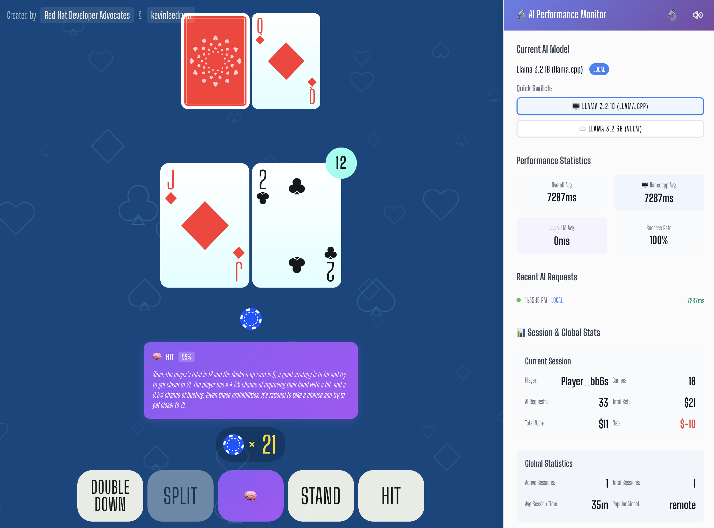

# Blackjack AI Game ♠️♥️♣️♦️ 🧠

> An AI-enhanced blackjack game for demonstrating local vs remote AI model performance

## 🎯 Overview

This is a Vue 3 blackjack game enhanced with AI capabilities that demonstrates the performance differences between local and remote AI models. The game features an AI advisor that tells players what "the book says" - providing optimal blackjack basic strategy recommendations.

### Key Features

- 🎮 **Full Blackjack Game**: Complete implementation with betting, splitting, doubling down
- 🧠 **AI Strategy Advisor**: Get recommendations from AI models using basic strategy
- ⚡ **Performance Comparison**: Real-time monitoring of local vs remote AI response times
- 🖥️ **Local AI**: Llama 3.2 1B running locally with Ramalama
- ☁️ **Remote AI**: Llama 3.2 3B running on vLLM remote endpoint
- 📊 **Session Tracking**: Multi-player session support with statistics
- 🔬 **Performance Monitoring**: Detailed metrics overlay for model comparison
- 🚀 **OpenShift Ready**: Complete deployment configurations included



## 🚀 Quick Start

### Local Development

1. **Clone the repository**
   ```bash
   git clone <repository-url>
   cd blackjack-ai-game
   ```

2. **Install dependencies**
   ```bash
   npm install
   ```

3. **Configure environment** (copy and modify as needed)
   ```bash
   cp .env.example .env.local
   ```

4. **Start development server**
   ```bash
   npm run dev
   ```

### With Local AI (Ramalama)

1. **Start with Docker Compose**
   ```bash
   docker-compose up --build
   ```

2. **Access the game**
   - Frontend: http://localhost:3000
   - Ramalama API: http://localhost:8080

## 🛠️ Configuration

### Environment Variables

| Variable | Description | Default |
|----------|-------------|---------|
| `VITE_USE_LOCAL_AI` | Use local Ramalama model | `true` |
| `VITE_LOCAL_AI_ENDPOINT` | Local AI endpoint URL | `http://localhost:8080` |
| `VITE_REMOTE_AI_ENDPOINT` | Remote vLLM endpoint URL | `https://llama-3-2-3b-maas-apicast-production.apps.prod.rhoai.rh-aiservices-bu.com:443` |
| `VITE_REMOTE_AI_KEY` | API key for remote endpoint | `your_api_key_here` |
| `VITE_SHOW_PERFORMANCE_MONITOR` | Show performance overlay by default | `false` |

### Model Configuration

The game supports two AI models:

1. **Local Model (Ramalama)**
   - Model: Llama 3.2 1B Instruct
   - Runs locally in Docker container
   - Faster inference but smaller model
   - Perfect for development and demos

2. **Remote Model (vLLM)**
   - Model: Llama 3.2 3B Instruct
   - Hosted remote endpoint
   - Higher latency but more capable model
   - Production-ready scaling

## 🎮 How to Play

1. **Start the game** - A new session begins automatically
2. **Place your bet** - Game starts with a $1 minimum bet
3. **Get your cards** - Two cards dealt to you, one to dealer
4. **Ask the AI** - Click "🧠 What does the book say?" for strategy advice
5. **Make your move** - Hit, Stand, Double Down, or Split based on AI recommendation
6. **Compare performance** - Toggle the performance monitor (🔬) to see AI metrics

### AI Strategy Advisor

The AI advisor uses basic blackjack strategy to recommend optimal plays:
- **Hit**: Take another card
- **Stand**: Keep current hand
- **Double Down**: Double bet and take exactly one more card
- **Split**: Split pairs into two hands

## 📊 Performance Monitoring

Click the 🔬 icon to view:
- Real-time response times for both models
- Success rates and error tracking
- Session statistics and global usage metrics
- Model switching capabilities
- Performance comparison charts

## 🐳 Docker Deployment

### Local Development with Ramalama

```bash
# Start all services
docker-compose up --build

# Production deployment (remote AI only)
docker-compose -f docker-compose.prod.yml up --build
```

### Custom Configuration

```bash
# Override environment variables
VITE_USE_LOCAL_AI=false docker-compose up
```

## ☁️ OpenShift Deployment

### Prerequisites

- OpenShift cluster access with project creation permissions
- `oc` CLI tool installed and logged in
- Container registry access (or use internal registry)
- API keys for remote vLLM endpoints (if using)

### Quick Deploy to Current Project

The simplest deployment approach (recommended for demos):

```bash
# Deploy all components to your current project
oc apply -f openshift/configmap.yaml
oc apply -f openshift/secret.yaml  
oc apply -f openshift/ramalama-deployment.yaml
oc apply -f openshift/frontend-deployment.yaml

# Create build and deployment
oc new-build --strategy docker --binary --name blackjack-ai-game
oc start-build blackjack-ai-game --from-dir . --follow

# Create frontend service and route
oc new-app --image-stream blackjack-ai-game --name blackjack-frontend
oc expose service blackjack-frontend --hostname=blackjack-demo.your-cluster-domain.com

# Get the application URL
oc get route blackjack-frontend
```

### Detailed Deployment Guide

#### 1. Environment Setup

First, ensure you're in the correct OpenShift project:

```bash
# Check current project
oc project

# Or create/switch to specific project
oc new-project blackjack-ai-demo
oc project blackjack-ai-demo
```

#### 2. Configure Secrets and ConfigMaps

```bash
# Create API key secret for remote vLLM (update with your key)
oc create secret generic ai-secrets \
  --from-literal=VITE_REMOTE_AI_KEY="your-actual-api-key-here"

# Apply configuration
oc apply -f openshift/configmap.yaml
```

#### 3. Deploy Ramalama (Local AI Service)

```bash
# Deploy Ramalama container for local AI
oc apply -f openshift/ramalama-deployment.yaml

# Monitor Ramalama startup (can take 5-10 minutes for model download)
oc logs -f deployment/ramalama-llama
```

#### 4. Build and Deploy Frontend

```bash
# Create build configuration
oc new-build --strategy docker --binary --name blackjack-ai-game

# Build from source
oc start-build blackjack-ai-game --from-dir . --follow

# Deploy the application
oc new-app --image-stream blackjack-ai-game --name blackjack-frontend

# Configure environment variables
oc set env deployment/blackjack-frontend \
  --from=configmap/ai-config \
  --from=secret/ai-secrets

# Create route with TLS
oc create route edge blackjack-frontend \
  --service=blackjack-frontend \
  --port=8080

# Get application URL
oc get route blackjack-frontend -o jsonpath='{.spec.host}'
```

### Deployment Configurations

#### Full Namespace Deployment

For production or isolated environments:

```bash
# Deploy to dedicated namespace
oc apply -k openshift/

# Monitor all deployments
oc get pods -n blackjack-ai-demo -w
```

#### Current Project Deployment (Recommended for Demos)

```bash
# Skip namespace creation, deploy to current project
oc apply -f openshift/configmap.yaml
oc apply -f openshift/secret.yaml
oc apply -f openshift/ramalama-deployment.yaml
oc apply -f openshift/frontend-deployment.yaml
```

### Troubleshooting Deployment Issues

#### Common Problems and Solutions

**1. Vite Base Path Issues**
- Symptom: Blank page or 404 errors for assets
- Solution: Ensure `base: '/'` in `vite.config.ts`

**2. Container Permissions**
- Symptom: Pod fails to start with permission errors
- Solution: nginx runs as non-root user (uid 101) with proper group permissions

**3. Environment Variable Injection**
- Symptom: API endpoints not configured correctly
- Solution: Check `docker-entrypoint.sh` handles runtime env substitution

**4. Image Pull Issues**
- Symptom: ImagePullBackOff errors
- Solution: Use internal image stream after building

#### Essential Commands for Debugging

```bash
# Check pod status and events
oc get pods
oc describe pod <pod-name>

# View application logs
oc logs deployment/blackjack-frontend
oc logs deployment/ramalama-llama

# Check services and routes
oc get svc,route

# Test connectivity
oc rsh deployment/blackjack-frontend
# Inside container: curl localhost:8080/health

# Check environment variables
oc set env deployment/blackjack-frontend --list
```

### Performance and Scaling

#### Resource Requests and Limits

```bash
# Set resource constraints for Ramalama (memory-intensive)
oc patch deployment ramalama-llama -p '{
  "spec": {
    "template": {
      "spec": {
        "containers": [{
          "name": "ramalama-llama",
          "resources": {
            "requests": {"memory": "2Gi", "cpu": "1000m"},
            "limits": {"memory": "4Gi", "cpu": "2000m"}
          }
        }]
      }
    }
  }
}'

# Scale frontend for high availability
oc scale deployment blackjack-frontend --replicas=3
```

#### Health Checks

```bash
# Configure readiness and liveness probes
oc patch deployment blackjack-frontend -p '{
  "spec": {
    "template": {
      "spec": {
        "containers": [{
          "name": "blackjack-frontend",
          "readinessProbe": {
            "httpGet": {"path": "/health", "port": 8080},
            "initialDelaySeconds": 10,
            "periodSeconds": 5
          },
          "livenessProbe": {
            "httpGet": {"path": "/health", "port": 8080},
            "initialDelaySeconds": 30,
            "periodSeconds": 10
          }
        }]
      }
    }
  }
}'
```

### Switching Between Local and Remote AI

To switch from local Ramalama to remote vLLM in OpenShift:

```bash
oc patch deployment blackjack-frontend -n blackjack-ai-demo -p '{"spec":{"template":{"spec":{"containers":[{"name":"blackjack-frontend","env":[{"name":"VITE_USE_LOCAL_AI","value":"false"}]}]}}}}'
```

## 🔧 Development

### Scripts

```bash
# Development
npm run dev          # Start dev server
npm run build        # Build for production
npm run preview      # Preview production build

# Quality
npm run type-check   # TypeScript checking
npm run lint         # ESLint with auto-fix
npm run format       # Prettier formatting

# Testing
npm run test:unit    # Run unit tests
```

### Project Structure

```
src/
├── components/          # Vue components
│   ├── AiRecommendation.vue       # AI advisor UI
│   ├── PerformanceOverlay.vue     # Performance monitoring
│   └── ...
├── services/           # Business logic
│   ├── aiService.ts              # AI API integration
│   └── sessionService.ts         # Session management
├── store.ts           # Game state management
└── types.ts           # TypeScript definitions

openshift/             # OpenShift deployment configs
docker-compose.yml     # Local development setup
Dockerfile            # Container build configuration
```

## 🎯 Demo Scenarios

### 1. Performance Comparison Demo

1. Start the game with performance monitoring enabled
2. Ask AI for recommendations using local model
3. Switch to remote model and compare response times
4. Show real-time metrics in the performance overlay

### 2. Load Testing Demo

1. Open multiple browser tabs/sessions
2. Generate concurrent AI requests
3. Monitor how local vs remote models handle load
4. Observe performance degradation patterns

### 3. Model Quality Comparison

1. Play several hands with each model
2. Compare recommendation quality and consistency
3. Track accuracy using the confidence scores
4. Analyze success rates over time

## 🛡️ Game Rules

- Initial bet: $1 minimum
- 6 decks, reshuffled at 25% remaining
- Blackjack pays 3:2
- Dealer stands on soft 17
- Double down on any two cards
- Split pairs (no re-splitting)
- No insurance available

## 🤝 Contributing

1. Fork the repository
2. Create a feature branch
3. Make your changes
4. Run tests and linting
5. Submit a pull request

## 📝 License

[MIT](http://opensource.org/licenses/MIT)

Copyright (c) 2025, AI Demo Project

---

Built with ❤️ using Vue 3, TypeScript, and modern AI technologies.
