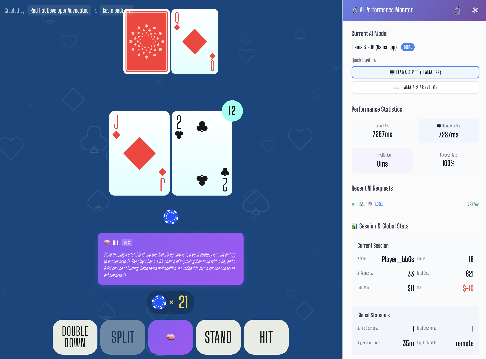

# Red Hat AI Blackjack Demo

Red Hat AI-enhanced blackjack game demonstrating performance differences between local and remote AI models.



## 🎮 Try the Demo Live!

**Experience AI-powered blackjack strategy recommendations with real-time performance comparison between local and remote AI models!**

Test the differences between:
- **Local AI**: Llama 3.2 1B (fast response, good accuracy)
- **Remote AI**: Llama 3.2 3B (higher accuracy, slower response)

---

*This is a demonstration project showcasing Red Hat AI integration patterns in gaming applications.*

## 1. Architecture

The demo architecture consists of the following components:


- **UI / Frontend**: Vue 3 blackjack game interface with performance monitoring
- **Llama-Stack Server**: AI model orchestration and strategy recommendation engine
- **MCP Servers**: Message Control Protocol integration for notifications
- **LLMs**: Local (Llama 3.2 1B) and Remote (Llama 3.2 3B) models

### 1.1 Flow Overview

1. The **Game Frontend** receives player actions and game state
2. The **AI Strategy Service** processes blackjack decisions and communicates with LLMs
3. The **MCP Servers** handle notifications and external integrations
4. The **LLMs** (Local/Remote) analyze game state and provide optimal strategy recommendations
5. The **Performance Monitor** displays real-time comparison metrics between models

### Key Features

- 🎮 **Full Blackjack Game**: Complete implementation with betting, splitting, doubling down
- 🧠 **AI Strategy Advisor**: Get recommendations from AI models using basic strategy
- ⚡ **Performance Comparison**: Real-time monitoring of local vs remote AI response times
- 🖥️ **Local AI**: Llama 3.2 1B running locally with Ramalama
- ☁️ **Remote AI**: Llama 3.2 3B running on vLLM remote endpoint
- 📊 **Session Tracking**: Multi-player session support with statistics
- 🔬 **Performance Monitoring**: Detailed metrics overlay for model comparison
- 🚀 **OpenShift Ready**: Complete deployment configurations included

## 2. Setup

### 2.1 Prerequisites

* OpenShift Cluster 4.17+
* OpenShift AI 2.16+
* 1 GPU with a minimum of 8GiB VRAM (for local AI model)
    * Supports both NVIDIA and Intel Habana Gaudi GPUs

### 2.2 Deploy the demo in OpenShift / OpenShift AI

To deploy the demo on your OpenShift environment:

```sh
oc apply -k kubernetes/deploy-demo
```

### 2.3 Deploy the demo locally

If you prefer to run the demo locally for development or testing purposes, follow the instructions in the [local deployment guide](./docs/deploy-demo-local.md)

#### Quick Local Setup

```bash
# Run the automated setup script
./local/deploy-local.sh

# Or manual setup
npm install
npm run dev          # Start at http://localhost:5173
```

#### Development Commands

```bash
npm run build        # Build for production
npm run test:unit    # Run tests
npm run lint         # Lint and format code
npm run type-check   # TypeScript checking
```

## 3. Sample Gameplay

Here are example interactions with the AI-powered blackjack system:

```
Player Action: Place $5 bet and receive cards (King, 6 = 16)
Dealer Shows: 10

AI Request: "I have a hard 16 and the dealer shows a 10. What should I do?"

Local AI Response (2.3s): "With hard 16 vs dealer 10, basic strategy says HIT. This is a tough spot but hitting gives you the best mathematical chance."

Remote AI Response (7.8s): "You have hard 16 versus dealer 10. According to basic blackjack strategy, you should HIT. The dealer has a strong upcard, and while hitting 16 is risky, it's mathematically the correct play."

Performance Comparison:
- Local AI: ✅ Fast response, correct recommendation
- Remote AI: ✅ Detailed explanation, correct recommendation
```

### Game Features

🎮 **Complete Blackjack Implementation**
- Betting, hitting, standing, doubling down, splitting
- Proper blackjack rules and payouts
- Multi-deck shoe with realistic shuffling

🧠 **AI Strategy Integration**  
- Real-time strategy recommendations
- Dual-model comparison (local vs remote)
- Fallback to basic strategy if AI fails

⚡ **Performance Monitoring**
- Response time tracking
- Success rate analysis  
- Real-time model comparison
- Session statistics

### AI Models Compared

| Model | Location | Response Time | Accuracy | Use Case |
|-------|----------|---------------|----------|----------|
| Llama 3.2 1B | Local (Ramalama) | 2-4 seconds | Good | Fast recommendations |
| Llama 3.2 3B | Remote (vLLM) | 6-10 seconds | Excellent | Detailed analysis |

## 📝 License

[MIT](http://opensource.org/licenses/MIT)

## 🙏 Acknowledgments

This project is based on the original blackjack game created by [Kevin Lee Drum](https://github.com/kevinleedrum). The AI integration, MCP protocol implementation, and OpenShift deployment features have been added to demonstrate Red Hat AI capabilities in gaming applications.

Special thanks to the Red Hat AI team for the infrastructure patterns and deployment strategies that make this demo possible.

---

*This is a demonstration project for educational and showcase purposes.*

Built with ❤️ using Vue 3, TypeScript, Llama models, and Red Hat OpenShift AI.